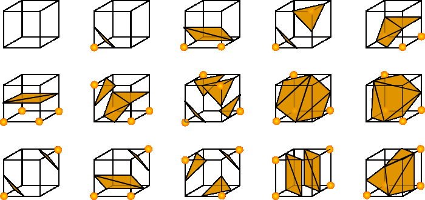

## Milestone Report

本项目的目标是完成一个基于粒子的流体模拟，能够在性能和真实程度上比较好地在离线运算的场景下计算并模拟流体的表现，并且以 Mesh 等建模的形式输出。

### 进展情况

目前已基本完成对粒子运动状态的简单模拟。考虑到 Scotty 3D 在使用和添加额外功能方面有较大的难度，因此临时使用了 bevy 引擎进行渲染，简单绘制出模拟状态下粒子的运动情况。

<video src="pic/simulation.mp4"></video>

目前正在完成从粒子到 Mesh 的转换过程，整体框架和代码基本已经完成，正在调试阶段。由于该部分尚未完全完成，因此还没有对应部分的成果展示。转换成果将在 Final Report 中给出。

### 后续计划

目前进度与最初计划相比略有落后。这有一部分原因是我们在最初尝试在 Scotty 3D 上增量地完成流体模拟，但是发现比较难在现有的代码模板上进行修改或操作。后续又将项目代码迁移至基于 Rust 语言的 bevy 引擎上，额外增加了一些试错成本。

根据中期进展调整后，后续的大致规划如下：

- 目前在在调试阶段的粒子转 Mesh 是一个简化后的算法。后续根据完成进度，可能考虑将该算法调整为简化前的版本，并将二者进行一些对比。
- 目前粒子模拟速度非常慢，在第二部分进行的同时，可能考虑对算法进行一些小的优化来加快最终的模拟速度；添加额外约束以提高真实性。
- 基于最终完成的代码，离线逐帧生成流体建模的模型并将其合成为一份完整的流体模拟结果的视频或动画等形式。

考虑到流体模拟和流体渲染实际上是独立的两个部分，且我们的工作中心主要在高效、真实地生成流体的状态模拟，因此原定计划中“渲染”相关部分的占比可能将让渡给提升真实性的尝试与优化性能的部分。最终的结果可能考虑会将我们模拟好的结果，逐帧导出成 .obj 等模型格式并使用 blender 等现有工具进行渲染、合成与展示。